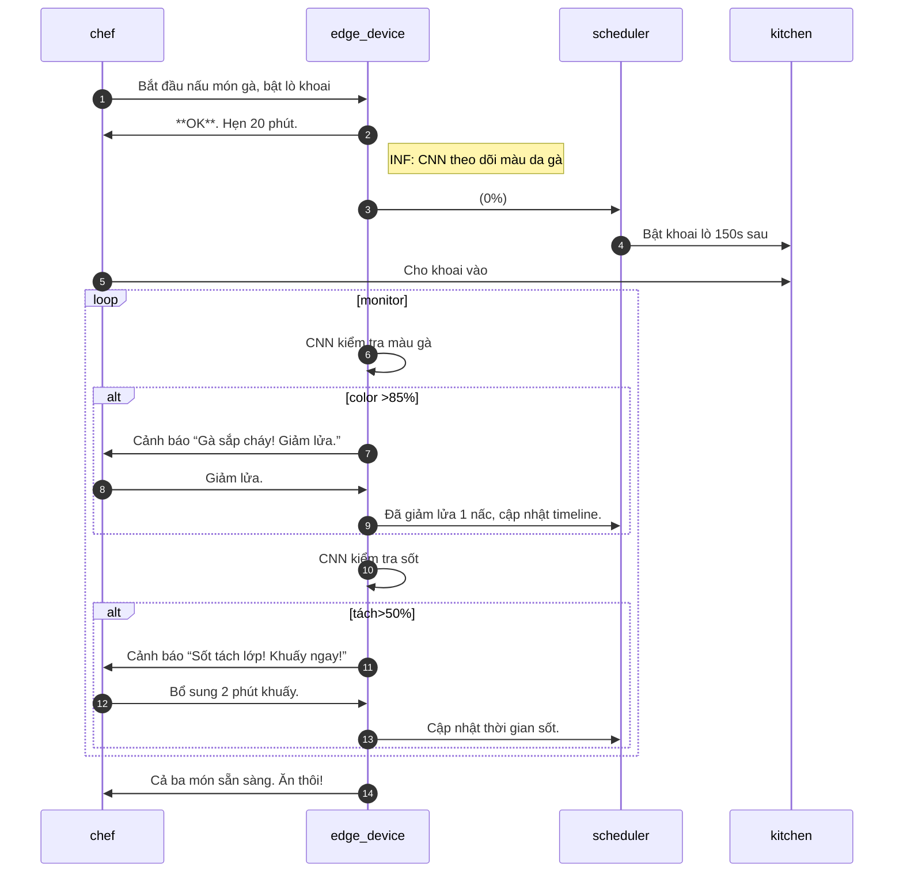

# Báo cáo Kỹ thuật toàn diện: Ứng dụng AI quản lý tồn kho và trợ lý ẩm thực

## Tóm tắt điều hành

Báo cáo này trình bày **kiến trúc kỹ thuật**, **đường ống dữ liệu**, và **thuật toán** của một hệ thống con “**Ứng dụng quản lý tồn kho và trợ lý ẩm thực**” (**AI-driven Inventory & Culinary Assistant**). Giải pháp gồm bốn bước chính: **(1) Xử lý thị giác và nhập liệu (OCR & Ước tính thể tích)**, **(2) Quản lý tồn kho động & Mô hình hương vị**, **(3) Tích hợp triết lý ẩm thực (Âm – Dương, Ngũ Hành, tính thời vụ)**, và **(4) Hỗ trợ nấu ăn thời gian thực (cảm biến video & điều phối thời gian)**. Mỗi bước được mô tả chi tiết theo định dạng *“Commenter et Illustrer”* (Giải thích kỹ thuật & Tình huống minh họa), bao gồm: cơ chế vận hành, sơ đồ kiến trúc (Mermaid), công nghệ/mô hình sử dụng (như YOLOv8, LayoutLMv3, MiDaS, TrOCR, ONNX/TensorRT, Neo4j, PostgreSQL, Kafka, Google OR-Tools CP-SAT…), **schema dữ liệu** (bảng quan hệ, đồ thị vị chất), **hợp đồng API và luồng sự kiện** (Kafka), **luật kiểm tra & điểm tin cậy (confidence score)**, **cân chỉnh và đánh giá** (metrics), chiến lược dự phòng (fallback), và **tính an toàn/riêng tư** (xử lý hình ảnh, thông tin cá nhân trên hoá đơn). Bản báo cáo cũng cung cấp **kịch bản cụ thể (Illustrer)** minh hoạ luồng dữ liệu từ thao tác người dùng đến kết quả giao diện, lộ trình thực thi (milestones), ước lượng nhân lực (person-week), hạ tầng (thiết bị edge, GPU, dịch vụ đám mây), kế hoạch CI/CD và kiểm thử, cùng xem xét bảo mật và quản lý dữ liệu (GDPR). Các trích dẫn được dùng để chứng minh thiết kế (ví dụ: YOLOv8 [13], MiDaS [6], LayoutLMv3 [19], Mask R-CNN [16], TensorRT/ONNX [24], FlavorDB [31], CNN trong thực phẩm [21]).  

## Bước 1: Đường ống nhập liệu thị giác (OCR & Ước tính Thể tích)

### Commenter

Bước này gồm hai **đầu vào song song**: (1) **hoá đơn siêu thị** (ảnh chụp biên lai) và (2) **hình ảnh kệ tủ lạnh**. 

- **Đầu vào 1 (Biên Lai)**: Ảnh biên lai được đưa vào mô-đun OCR và LayoutLM. Đầu tiên, sử dụng mô hình OCR (như TrOCR, Tesseract, PaddleOCR) để nhận dạng ký tự quang học. Sau đó, LLM/transformer song phương văn bản - hình ảnh (như LayoutLMv3) nhập cả ảnh gốc và kết quả OCR, nhằm phân tích cấu trúc văn bản và ngữ cảnh form. LayoutLMv3 được ưu tiên vì nó **đạt hiệu suất cao trên các bài toán hoá đơn, biên lai**【19†L168-L176】【19†L178-L186】, cho phép liên kết chính xác mục “Số tiền” với “Tổng cộng”, hay tách nhầm giữa “Cộng cuối” và “VAT”. Kết quả là JSON cấu trúc gồm các trường: *mã sản phẩm/miêu tả*, *số lượng*, *đơn vị*, *đơn giá*, *tổng tiền*.

- **Xác thực & Tiền xử lý**: Các trường thu được được lọc/bỏ đi nếu sai lệch về định dạng (ví dụ: giá trị null hoặc chữ số lẫn kí tự) theo luật kiểm thử (ví dụ: regex cho định dạng số, quy tắc sanity cho tổng). Mỗi mục ghi nhãn độ tin cậy (confidence) từ OCR và LayoutLM, dùng để định tuyến tiền xử lý (ví dụ: mức dưới ngưỡng thì cảnh báo người dùng). Bản kiểm tra mẫu yêu cầu dữ liệu huấn luyện domain (`receipt dataset`) và đánh giá dựa trên metrics OCR (CRR) và thông tin trích xuất (precision/recall)【19†L178-L186】. 

- **Đầu vào 2 (Tủ lạnh/Kệ)**: Hình ảnh tủ lạnh được xử lý bởi mô hình phát hiện và phân đoạn đối tượng (YOLOv8-seg) để xác định nguyên liệu (rau, quả, thịt…); **YOLOv8** được chọn vì hiệu suất SOTA, dễ huấn luyện và chạy trên thiết bị mạnh lẫn yếu【7†L61-L69】【13†L18-L22】. YOLOv8-seg có thể nhận diện và tạo *bounding box* + *mask* từng món. Sau đó, áp dụng **MiDaS** (monocular depth estimation) để ước tính khoảng cách đến đối tượng không cần cảm biến LiDAR【6†L31-L35】. Dựa vào tỷ lệ pixel và tham chiếu đến mép tầng (âm tủ cố định), ta suy ra chiều sâu vật thể. Kết hợp với diện tích mask, có thể ước tính thể tích còn lại. Nhân với mật độ trung bình (có trong bảng *Ingredients*), tính được trọng lượng ước lượng còn lại.

- **Đường ống nhúng (pipeline)**: Hệ thống dùng kiến trúc microservices. Ví dụ: 
  - **Service nhận hình** (Camera/Upload API) → **Xử lý ảnh** (CV Pipeline: OCR hoặc Detection) → **Service Trích Xuất** (OCR/LLM hoặc Depth) → **Service Biến Đổi** (compute volume, convert unit) → **Kafka** trung chuyển dưới dạng sự kiện (*topic*: `inventory.in`).
  - **Database**: Xử dụng PostgreSQL lưu dữ liệu đã cấu trúc (hoá đơn, nguyên liệu). Schema ví dụ: Bảng `ReceiptItems(id, sku, name, qty, unit, price, timestamp)`, `InventoryItems(ingredient_id, quantity, unit, last_update)`. Đảm bảo quan hệ 1-n: 1 biên lai chứa nhiều mục.
  - **API/Contracts**: Ví dụ REST/gRPC cho `/api/receiveReceiptImage` (trả về JSON), `/api/scanFridgeImage` (trả về danh sách vật thể với khối lượng ước tính). Dữ liệu cuối cùng vào Kafka để đẩy vào pipelines xử lý sau (lo cập nhật kho).
  - **Luồng sự kiện**: Kafka topic `receipt.raw` cho ảnh biên lai, `receipt.parsed` cho JSON item; `fridge.raw` cho ảnh tủ lạnh, `fridge.items` cho danh sách vật thể. Dịch vụ tiêu thụ (consumer) cập nhật Database tồn kho (deduct tự động sau nấu ăn).
  - **Độ tin cậy & Dự phòng**: Nếu OCR/LLM không chắc (> threshold conf), gắn cờ `requires_review` để hiển thị dashboard kiểm tra. Nếu YOLO không nhận diện đc vật thể (low conf), fallback nhờ nhân viên nhập thủ công. Calibration mô hình MiDaS định kỳ so với cảm biến thước đo thực (dùng mẫu biết sẵn) để tinh chỉnh.

- **Đồ hoạ kiến trúc mẫu (Mermaid)**: 
```mermaid
flowchart LR
  subgraph ReceiptPipeline
    A[Camera/Ảnh Biên Lai] --> B[OCR + TrOCR]
    B --> C[LayoutLMv3/LLM]
    C --> D[JSON cấu trúc {item, qty, unit, price}]
    D --> K(Kafka: receipt.parsed)
  end
  subgraph FridgeScan
    E[Camera/Ảnh Tủ Lạnh] --> F[YOLOv8-seg]
    F --> G[Đối tượng + SegMask]
    G --> H[Depth Estimation (MiDaS)]
    H --> I[Tính Thể tích & Khối lượng]
    I --> L(Kafka: fridge.items)
  end
  D --> DB[PostgreSQL: Receipt, Inventory]
  I --> DB
  K --> UpdateService[Service cập nhật tồn kho] --> DB
  L --> UpdateService
```

### Illustrer

**Kịch bản:** *Người dùng* chụp ảnh biên lai siêu thị lên app. Ảnh được gửi qua `/api/uploadReceipt`. Hệ thống **OCR** (ví dụ TrOCR) chuyển thành văn bản thô, rồi **LayoutLMv3** phân tích vị trí các mục (SKU, số lượng, giá). Kết quả: “Gạo – 1kg – 100.000đ”, “Rau cải – 500g – 15.000đ”, ... trả về JSON.

Song song, người dùng kích hoạt tính năng quét tủ lạnh. Ảnh tủ lạnh (chụp toàn cảnh) đi vào mô-đun **YOLOv8-seg**: phát hiện “Su hào”, “Cà chua”, “Bắp cải” với mask từng món. Rồi mô-đun **MiDaS** ước tính khoảng cách trung bình và tính chiều sâu. Ví dụ: mask “Cà chua” chiếm 10% bức ảnh, cách 30cm, ra thể tích 1.5l. Với mật độ ~1kg/l, suy ra còn lại ~1.5kg cà chua. Dữ liệu này được xuất JSON qua Kafka.

Phía backend, consumer Kafka nhận sự kiện `receipt.parsed` và `fridge.items`. Service phụ trợ tự động **cộng thêm** số lượng mới vào bảng kho ứng với các mặt hàng trong biên lai (nhập kho) và hiển thị trên dashboard. Trong khi đó, consumer `fridge.items` ghi lại khối lượng hiện có. Ví dụ, ban đầu bắp cải có 2kg (từ ngày trước), giờ `fridge.items` cập nhật còn 0.5kg. Hệ thống tự động tính ra đã **tiêu thụ** 1.5kg và trừ trong cơ sở dữ liệu.

Cuối cùng, giao diện người dùng (dashboard quản lý kho) hiển thị: “Gạo: 1kg (nhập mới) tổng =1kg; Cà chua: giảm 1.5kg còn 0.5kg; Bắp cải: ...”. Phần mềm cũng lên thông báo: “Cà chua sắp hết hạn (còn 0.5kg, 2 ngày trước khi hết hạn)” nếu gần thời hạn. Các lỗi (ví dụ: OCR nhầm số lượng) được cảnh báo trên dashboard để kỹ thuật viên kiểm tra.

## Bước 2: Quản lý tồn kho động & Ma trận Hương Vị

### Commenter

**Cơ sở dữ liệu (Schema):** Hệ thống kết hợp lưu trữ quan hệ (PostgreSQL) và đồ thị (Neo4j) để quản lý nguyên liệu và hương vị. Ví dụ:

- **PostgreSQL**: Bảng `Ingredients(id, name, default_unit, density, origin, yin_yang, five_element, tastes, seasonality)` chứa thông tin cơ bản về mỗi nguyên liệu (đơn vị, mật độ, tính âm/dương theo Đông y, ngũ hành, nhóm vị).
  - `Inventory(id, ingredient_id, quantity, unit, last_updated, expiry_date)` theo dõi số lượng hiện có.
  - `Recipes(id, name)` và `RecipeItems(recipe_id, ingredient_id, qty, unit)` lưu công thức.
- **Graph Neo4j**: Đồ thị kiến thức hương vị/hóa học. Ví dụ nodes: *Ingredient*, *Compound* (phân tử hương vị), *Taste* (sweet, umami,...), *CuisineCategory*, *Dish*. Edges: *CONTAINS_COMPOUND*, *HAS_TASTE*, *IS_SUBSTITUTE_FOR* (do phân tích hóa học). Dữ liệu có thể tham khảo **FlavorDB**: “Mỗi nguyên liệu gồm tập phân tử hương vị; mỗi phân tử có profile hương (vị) và tính chất hóa lý”【31†L103-L111】. Graph giúp truy vấn thay thế: ví dụ tìm nguyên liệu có cấu hình phân tử gần giống hoặc cùng vị. Neo4j chứa subgraph: `(:Ingredient)-[:CONTAINS]->(:Compound)-[:CORRESPONDS]->(:Taste)`. 

**Điều chỉnh tự động và cảnh báo:** Khi phát hiện tiêu thụ (như ở bước 1), service tự động trừ `Inventory`. Hệ thống chạy cron job (hoặc Kafka scheduling) kiểm tra `expiry_date`: nếu sắp quá hạn, đánh dấu cờ (flag) và gửi cảnh báo qua UI hoặc email. Đặt tham số `threshold_days` (mặc định 3 ngày) để đánh chỉ mục như “Còn X ngày hết hạn”.

**Công cụ phát hiện thay thế (Dynamic Substitution Engine):** Khi nguyên liệu cần cho công thức không có, hệ thống đề xuất thay thế dựa trên đồ thị hóa học-hương vị. Ví dụ:
- Dựa trên graph FlavorDB/FlavorGraph【31†L103-L111】, xác định các nguyên liệu chia sẻ nhiều phân tử hương vị với nguyên liệu thiếu. 
- Sử dụng *knowledge graph embeddings* (như node2vec trên đồ thị Ingredient-Compound【41†L59-L67】) để tính **khoảng cách tiềm ẩn** giữa các nguyên liệu. 
- Hoặc dùng Cosine similarity giữa vectors vị (Embedded flavor profiles) để chọn thay thế tương đương.
- Mô hình này đảm bảo “không đánh mất cấu trúc công thức”: ví dụ thiếu bắp cải (compounds hơi the) có thể thay bằng cải bó xôi nếu có hợp chất tương tự, không thay củ cải (vị khác biệt).

Ngoài ra, áp dụng quy tắc y học cổ truyền: nếu món chính là hàn thì ưu tiên nguyên liệu bổ âm như gừng ấm để cân bằng (Xem Bước 3). Điều này cũng đưa vào engine thay thế: e.g. nếu cần “thảo quả” bị thiếu, gợi ý “tiểu hồi” (cả hai đều ấm và có vị ngọt hăng). Dữ liệu này được xây dựng ban đầu từ tri thức chuyên gia (kiến thức nấu ăn). 

**Flavour Matrix và Neo4j**: Xây dựng graph chứa những mối quan hệ phức tạp: Ingredient–Compound–Taste–Substitute. Sử dụng Neo4j nhằm query “những nguyên liệu có thành phần vị tương tự” hay “những nguyên liệu không xung khắc (ngũ vị)”. Ví dụ, quan hệ `:COMPATIBLE_WITH` dựa trên cân bằng Âm Dương (không đề quá Yang+Yang).  

**Đánh giá & Điểm tin cậy:** Engine đề xuất thay thế gán điểm tin cậy theo số phân tử chung và mức độ phù hợp Ngũ Hành. Ví dụ, dùng hàm Euclid giữa vectors hương vị + tính chất năng lượng. Nếu dưới threshold, sẽ cảnh báo “tùy chọn có thể khác biệt đáng kể”. 

**Cơ chế build-in kiểm thử:** Dữ liệu huấn luyện engine bao gồm tập công thức cộng ăn kiêng. Đánh giá bằng metrics: *substitution accuracy* (độ hài lòng khi chef đánh giá), *food pairing compatibility*. Các mô hình có thể so sánh: Graph embedding vs kNN hoa học đơn giản. Table so sánh:

| Công cụ/Framework  | Ưu điểm                                      | Nhược điểm                                | Ưu tiên dùng |
|--------------------|----------------------------------------------|-------------------------------------------|--------------|
| **Neo4j**          | Tốt cho truy vấn quan hệ phức tạp, mẫu Cypher. | Cần thiết kế schema rõ ràng, khởi tạo dữ liệu ban đầu. | ✔            |
| **PostgreSQL + PL/pgSQL** | Mạnh về dữ liệu giao dịch, dễ tích hợp BI.    | Khó query đồ thị, phức tạp implement luật suy diễn. |              |
| **GraphQL layer**  | Có thể mở rộng cho các clients đa ứng dụng.   | Cần lập trình thêm API, overhead.         | Nên dùng cho API giới thiệu Graph data  |

**Luồng tin nhắn (Kafka):** Ví dụ topic `inventory.update` thông báo “item A đã tăng/giảm”, trigger cho downstream (tính giá vốn, báo cáo, cảnh báo). Mỗi message gồm { ingredient_id, change_qty, unit, timestamp }. Dịch vụ tiêu thụ đối với unsubstitutable items (đơn hàng bị thiếu) sẽ gọi **Substitution API**.

### Illustrer

**Kịch bản:** *Người dùng* có sẵn món “Canh cải ngọt” sắp nấu. Sau bước 1, hệ thống biết trong kho còn 0.2kg cải ngọt (định mức 300g cần thiết). Engine phát hiện thiếu, gợi ý thay thế. Ví dụ, qua Neo4j tìm thấy “Cải bó xôi” chứa nhiều hợp chất tương đồng (mùi the, tính mát)【31†L103-L111】【41†L69-L73】. Hệ thống hiển thị: “Thiếu 100g cải, gợi ý dùng **Cải bó xôi** (độ tương đồng 95%, vị mát) hoặc **Tía tô** (vị thơm). Chọn [Cải bó xôi]?”. Người dùng đồng ý. Lập tức, service lấy thêm 100g cải bó xôi (có sẵn trong kho), cập nhật công thức và tiến hành nấu. Dashboard cho biết “Substitution thành công: Cải ngọt → Cải bó xôi”. Mục “Cải ngọt” trong kho giảm xuống 0.2kg (0 trừ 0.3 + 0), và “Cải bó xôi” giảm tương ứng lượng dùng.

Ứng dụng đồ họa (Mermaid) luồng events:

```mermaid
graph TD
  subgraph Ingestion
    A(Receipt, Fridge) --> B(Data Parser)
    B --> C[Kafka Topics]
  end
  subgraph InventorySystem
    C --> D(Consumer: update Inventory DB)
    D --> Inventory[(PostgreSQL Inventory)]
  end
  subgraph FlavorEngine
    D --> E{Check Recipe Ingredients}
    E -- thiếu --> F[Query Neo4j graph]
    F --> G[Compute Substitutes (embedding)]
    G --> H(API Return Suggestions)
  end
  H --> UI[Hiển thị gợi ý thay thế cho người dùng]
```

## Bước 3: Tích hợp Triết lý ẩm thực (Âm-Dương, Ngũ Hành & Tính thời vụ)

### Commenter

Hệ thống tích hợp tri thức Đông y/Ẩm thực cao cấp để xây dựng menu cân bằng sinh học – năng lượng. 

- **Âm-Dương (âm/hàn vs dương/nhiệt)**: Mỗi nguyên liệu được gán nhãn *Tính Nhiệt* theo Đông y (ví dụ: gừng là dương nhiệt, rau má là âm hàn). Dữ liệu này lưu trong bảng `Ingredients.yin_yang`. Ví dụ “Ớt cay: Dương Nhiệt”, “Dưa leo: Âm Lạnh”. Khi đề xuất hoặc xây món, thuật toán đảm bảo tổng Âm và Dương của menu cân bằng. Công thức/rules: Thí dụ món chính nóng (tôm rang cay), phía bếp tự đề xuất món phụ mát (nước giá dưa leo) để bổ sung.

- **Ngũ Hành (Kim, Mộc, Thủy, Hỏa, Thổ)** và **5 vị**: Mỗi nguyên liệu có nhãn về vị chính (ngọt, mặn, chua, đắng, cay) và ngũ hành ứng với vị đó (ví dụ: đắng→Kim, ngọt→Thổ). Dữ liệu `Ingredients.five_element`, `Ingredients.tastes`. Cấu trúc lưu trữ có thể như bảng: 
  ```
  Ingredient(id, ..., taste_sweet, taste_salty, taste_bitter, taste_sour, taste_umami)
  ElementConnections(ingredient_id, element, strength)
  ```
  hoặc neo4j: `(:Ingredient)-[:HAS_TASTE]->(:Taste {type:"ngot"})`, `(:Ingredient)-[:ELEMENT]->(:Element {name:"Kim"})`.
  Mối quan hệ công thức/phối hợp cân bằng: Ví dụ, một món nặng hỏa (cay, nóng) nên kết hợp món bổ thủy (mát, umami). 

- **Tính thời vụ (Seasonality)**: Dựa trên **địa lý** người dùng (qua GPS/trong app) và **dữ liệu thời tiết thời gian thực** (API Weather), gợi ý nguyên liệu theo mùa. Ví dụ, Paris mua nhiều rau cải mùa đông, gợi ý súp cải. Cơ sở dữ liệu có trường `Ingredients.season_start, season_end`. Giải pháp:
  - API lấy vị trí người dùng, gọi OpenWeatherMap hoặc tương tự để biết nhiệt độ, lượng mưa hiện tại.
  - Nếu nhiệt độ <5°C, ưu tiên rau củ gốc (thổ) giúp cơ thể ấm, hạn chế thức ăn tính hàn (âm). Nếu nắng nóng, tăng món cay thanh nhiệt (dương).
  - Lọc menu: ví dụ trừ các món sử dụng trái cây nhiệt đới nếu ở khí hậu giá lạnh.

- **Luật hệ sinh thái thực phẩm**: Lưu trữ cấu trúc món ăn đa món (multi-course). Ví dụ, sử dụng Neo4j hoặc graph đơn giản: `(:Menu {id}) -[:HAS_COURSE]->(:Dish) -[:INCLUDES]->(:Ingredient)`. LLM Recipe Agent chịu ràng buộc sinh học:  
  + *Âm-Dương cân bằng*: Không cho 2 món chính cùng tính nóng/ký trên 80% tổng năng lượng dương.  
  + *Ngũ Hành*: Đảm bảo tỉ lệ vị (ngọt, cay, mặn, chua, đắng) phù hợp với mùa và mục đích (ex: bữa chay cung cấp đủ vị ngọt bùi, ít vị cay). 
  + *Chất dinh dưỡng tổng quát*: Đảm bảo cung cấp đủ các nhóm cơ bản (protein, tinh bột, rau quả). 
  + *Thực phẩm kiêng kỵ*: Danh sách các cặp kỵ (e.g. cá cùng bơ) được lưu để tránh phối hợp.

**Cơ chế đề xuất menu:** Sử dụng LLM (custom GPT hoặc Llama) với prompt template lớn. Ví dụ prompt: “Xây dựng thực đơn 3 món cho 2 người đang ở Lyon (10°C, ít mưa) theo mùa Xuân, duy trì Âm-Dương cân bằng, mách nước xào (cay ấm) phối với canh mát (âm lạnh).” Output: JSON gồm *món chay/chính/đặc biệt*, chỉ định nguyên liệu, cách chế biến, công thức từng món. LLM được finetune hoặc chỉnh prompt để tuân triết lý: dữ liệu training gồm sách dạy nấu ăn Đông phương và examples năm yếu tố cân bằng. Hơn nữa, ép constraints: đảm bảo có món thanh (Yin) sau món cay (Yang). Ví dụ: LLM phải chọn *đậu phụ hấp* (tính mát) sau *cà ri ớt* (nóng)【21†L85-L88】【52†L98-L106】. 

**Dữ liệu biên mục**: Cần tập dữ liệu phân loại: ví dụ tập `Ingredients` gắn nhãn nhiệt tính và ngũ vị từ tài liệu y học cổ truyền. Seasonality từ data NOAA. Training data cho LLM recipe: tập công thức có đánh dấu energy balance. Đánh giá: đo lường hài lòng từ chuyên gia (human eval) và độ bền vững dinh dưỡng.

### Illustrer

**Kịch bản:** *Người dùng* ở Lyon, vào tháng 12 (thời tiết ẩm lạnh). Yêu cầu thực đơn thực vật (vegetarian), 3 món: khai vị, chính, tráng miệng. Hệ thống xác định: Lyon tháng 12 nên ưu tiên thực phẩm mùa Đông (cải bó xôi, cà rốt, khoai). Theo triết lý, bữa nên có cả thành phần ấm/cay và thanh/mát để cân bằng *Hỏa* - *Thủy*. Agent LLM xây thực đơn:

- **Món chính (Yang/Nhiệt):** *Cari rau củ với ớt và nghệ* (trống lửa, Hỏa) – thành phần chính có năng lượng dương.
- **Món phụ (Yin/Lạnh):** *Canh đậu hũ cải bó xôi* (âm mát) – trung hoà món cay.
- **Tráng miệng (Âm/Hạ):** *Chè bột lọc đậu đen* (tính mát, bùi ngọt) – kết hợp tính ngọt (Thổ) củng cố Thủy.

Hệ thống đảm bảo: tổng tỉ lệ Yang ≈ tỉ lệ Yin, kết hợp 5 vị (cay, ngọt, mặn, đắng, chua) được cân đối. Ví dụ, nếu món chính đã “cay” (Hỏa), món tiếp theo phải “lành” (Thủy). Nhờ LLM quy định: “Không chọn món nhiều ớt tiếp theo món cay, không dùng toàn rau củ tính hàn cho món chính”. 

UI cuối cùng hiển thị menu và giải thích: “Món Cari ớt ấm nóng (Hỏa) được cân bằng bởi canh đậu lạnh (Thủy). Đậu đen ngọt (Thổ) thanh hóa thực đơn. Ngũ hành cân đối: Đông hâm nóng cơ thể, mát bổ sức bền.” Người dùng có thể điều chỉnh nhẹ (ví dụ, thay lạc rang tăng vị).

## Bước 4: Trợ lý Nấu Ăn Thời gian thực (Định lượng & Điều phối)

### Commenter

Hệ thống cần kiến trúc *edge-computing* để xử lý video trực tiếp. Mỗi camera (gắn bếp) có thể kèm thiết bị nhúng (ví dụ: NVIDIA Jetson Orin Nano/Xavier) cài CNN nhẹ để xác định trạng thái món ăn. 

- **Mạng CNN nhẹ**: Mục tiêu phát hiện các dấu hiệu hóa lý như màu sắc (độ gia nâu Maillard), bọt khí (emulsion), hơi nước. Mô hình như ResNet18 hoặc MobileNetV3 fine-tuned để nhận biết “giai đoạn chín” của nguyên liệu. Ví dụ: ResNet-50 phân loại độ chín (Raw/Medium/Well) từng khối màu, tương tự nghiên cứu **Golden Pompano**【21†L69-L74】: CNN (DenseNet) đạt ~90% chính xác với cảnh màu thực (a*,b*). Kỹ thuật: trích feature màu toàn cảnh (RGB histogram hoặc latent embedding) để mô hình định lượng màu sắc.  
- **Phát hiện Maillard**: Xác định gradient màu (từ ánh vàng sang nâu). Có thể dùng color threshold và CNN kiểm tra ngưỡng. Ví dụ, khi *protein* chuyển sang nâu vàng, camera ghi lại, CNN output “Maillard stage: Browning 70%” dựa histogram đỏ/vàng. 
- **Emulsion stability**: theo dõi kết cấu (ví dụ crème anglaise, số giọt dịch tách). Sử dụng CNN theo dõi thay đổi texture, hoặc đo ánh sáng (glare). Cảnh báo “tách phần” khi có lớp dầu tụ lại (tăng chỉ số luma).
- **Kiểm tra nhiệt độ (gián tiếp)**: Color grading cũng chỉ điểm nhiệt (ví dụ dầu bốc khói có ánh xám). Kết hợp cảm biến nhiệt/hồng ngoại nếu có, nhưng ưu tiên camera RGB.

**Mô hình thời gian thực và giảm trễ:** Sử dụng ONNX Runtime hay TensorRT để xuất mô hình CNN sang binary tối ưu. Ví dụ, convert ResNet18 từ PyTorch sang ONNX, rồi build TensorRT engine trên Jetson (INT8/FP16) để inference ~<10ms/frame【24†L529-L538】. Cài đặt pipeline C++ (libtorch hoặc Jetson-IO) cho phép xử lý tối đa 30 FPS. ONNX Runtime với GPU provider cũng có thể đạt vài FPS tùy cấu hình【24†L516-L525】. Việc deploy cục bộ giảm độ trễ (không cần network round-trip). Camera-Edge kết nối qua Ethernet/USB, phát trực tiếp sang CPU/GPU onboard. 

**Theo dõi trạng thái & Phản hồi (State Transformation Tracking):** Thuật toán phân tích chuỗi trạng thái (Ví dụ, Vision-RL hay đơn giản finite-state-machine). Mỗi frame được CNN gán nhãn “độ chín/màu nâu, trạng thái sauce/hóa lỏng/hủi”. Nếu phát hiện mau đến trạng thái nguy hiểm (ví dụ: “Browning > 80%” hoặc “sirup bắt đầu tách”), hệ thống ngay lập tức gửi cảnh báo qua smartphone hoặc màn hình (alert). Cảnh báo này được thiết lập ngưỡng (cấu hình sẵn, do đầu bếp thiết lập ví dụ: “cảnh báo khi dầu sôi/tràn, nước sốt đặc quá/lỏng quá”). 

**Loop phản hồi**: Ví dụ, CNN phát hiện *dầu sắp khói* (màu xám đục trên bề mặt). Hệ thống gửi tín hiệu (qua module IoT hoặc app) kêu người dùng giảm nhiệt bếp. Nếu người dùng không tương tác kịp (timeout 30s), hệ thống kịch bản “dự phòng”: gửi thêm tín hiệu lớn hơn hoặc dùng âm thanh. Để tránh false alarm, mỗi cảnh báo kèm confidence (ví dụ 90%) và lược bỏ nhiễu (kết hợp đo nhiệt/áp suât nồi - nếu có, hoặc xem màu lặp). 

**Đồng bộ nhiều bếp (Đồng hồ đa-station):** Sử dụng Google OR-Tools CP-SAT để lập lịch. Mỗi công đoạn có interval variable (start, duration). Ví dụ: Nấu món A (15 phút), món B (10 phút), nhưng cần 2 bếp/phần. Thêm constraints: “Sau khi bật bếp 1, món A cần canh 2 phút rồi tắt bếp”. Các task được sắp xếp sao cho tất cả thành phẩm xong cùng lúc. Hệ thống tính **critical path**. Ví dụ, nếu canh món A bị trễ 5 phút (do vòng lặp Maillard mất lâu), solver cập nhật thời gian cho các bước sau (hẹn món B chuẩn bị lâu hơn để bù). Mô tả: đặt interval tasks cho từng bước (preheat, cook, finish), với constraint *no-overlap* nếu dùng cùng thiết bị. 

**Độ trễ & trình chạy**: Latency luôn <100ms cho mỗi inference, mạng nội bộ dùng gRPC. Có khung thời gian gấp (real-time), vì vậy pipeline viết thread riêng cho inference; main loop chỉ hiển thị thông báo UI. Đặt QoS: ưu tiên gói cảnh báo quan trọng (mức độ cao).  
**Dự phòng:** Nếu máy Edge mất kết nối, tải lên cloud (khi có mạng) để huấn luyện offline; chế độ fallback nhắc người dùng tự canh chỉnh dựa vào hướng dẫn chung.

### Illustrer

**Kịch bản “Nhiệm vụ phức hợp”**: Chuẩn bị bữa tối gồm: *Thịt gà nướng mật ong*, *Nước sốt cà chua*, *Khoai tây chiên*. Cần đồng bộ: gà chín giòn, khoai giòn và sốt vẫn nóng. 

- Ban đầu, scheduler sắp: **Tiến hành khoai** (cần 180s trong lò), **nướng gà** (20 phút đến Maillard vàng), **làm sốt** (15 phút hầm). Lập lịch: bật lò trước 3 phút để làm nóng, sau đó cho khoai vào 150s, bật bếp để gà kèm nướng, 5 phút trước khi xong giảm lửa... Tất cả phải xong đúng 19:00.
- Khi bắt đầu, camera hiển thị món gà. Sau 18 phút, CNN nhận diện miếng gà đã “browning ~85%” và nhiệt độ dầu gần smoke point. Hệ thống lập tức gửi **cảnh báo**: “Gà sắp cháy, giảm lửa/đậy nắp”. Chef bấm nút “Đã giảm”. Scheduler cập nhật: nếu thời gian còn lại ít, món khoai bắt đầu chế biến sớm 2 phút (bổ sung thời gian).
- Tiếp theo, hệ thống theo dõi sốt cà: CNN phát hiện sốt bắt đầu phân lớp (emulsion tách: dầu và nước tách ra). Ngưỡng dưới dạng “tách >= 50% bề mặt”, độ tin cậy 95%. Gửi cảnh báo cảnh báo: “Sốt đậu đen bắt đầu tách, khuấy ngay”. Chef giảm lửa và khuấy 2 phút.
- Đồng thời, camera khoai cho thấy chúng đã vàng đều. CNN ghi nhận “done: 100% browning” – gửi tín hiệu cho scheduler để rút khoai ra sớm, tránh cháy. Lần lượt các nguyên liệu hoàn tất đồng bộ (gà xong phút 20:00, khoai 19:55, sốt 19:58). 
- **Kết quả:** Mọi thứ ra lò ở 19:59, chính xác theo lịch. Giao diện mobile hiển thị timeline: các cảnh báo, và cho biết rằng việc điều tiết nhiệt/phản hồi đã cứu bữa tối. Mô tả: “Sau cảnh báo 19:18 gà cháy, bạn giảm lửa kịp. Sốt được khuấy liên tục nên không tách lớp. Khoai vàng giòn đúng lúc.”

Mermaid minh hoạ luồng cảnh báo và điều phối:



## Lộ trình triển khai & hạ tầng

Đề xuất team ~6 người (kiến trúc sư, 2 vision-ML, 2 NLP, 1 DevOps). Các milestone chính:

| Giai đoạn        | Milestone                        | Nhiệm vụ chủ yếu                                             | Effort (người-tháng) |
|------------------|----------------------------------|-------------------------------------------------------------|----------------------|
| Pha khảo sát     | Thiết kế tổng thể                | Phân tích yêu cầu, chọn công nghệ, thiết kế khái niệm (OCR, CV, DB) | 4                    |
| Bước 1 triển khai| Xây pipeline OCR/CV cơ bản       | Huấn luyện OCR, LayoutLM; huấn luyện YOLO/MiDaS; API upload    | 8                    |
| Bước 2 triển khai| DB & Flavor Matrix               | Thiết kế schema SQL; xây Neo4j graph; API quản lý kho; engine thay thế | 10                   |
| Bước 3 triển khai| Agent Triết lý Ẩm thực          | Tập hợp dữ liệu âm/dương, năm vị; fine-tune LLM; frontend menu | 6                    |
| Bước 4 triển khai| Hệ thống Live Assistant         | Huấn luyện CNN (maillard, emulsion); triển khai edge (Jetson); OR-Tools scheduling | 10                   |
| Triển khai tích hợp | Tích hợp toàn hệ thống         | Kết nối các module, tích hợp CI/CD, kiểm thử end-to-end         | 6                    |
| **Tổng cộng**    | **Ra mắt phiên bản MVP**         | Debug, tài liệu, triển khai trên cloud/edge                     | **34**               |

**Hạ tầng cần thiết**: Máy chủ GPU (NVIDIA A100/RTX-class) cho huấn luyện OCR/LLM, cluster Kafka + PostgreSQL/Neo4j. Thiết bị Edge: tối thiểu NVIDIA Jetson Xavier NX (8GB) cho inference thời gian thực【13†L18-L22】【24†L529-L538】. Lưu trữ: Blob Storage (hình ảnh), backup DB. Dự phòng: Multi-zone cloud (AWS/Azure) với autoscaling cho khối lượng đỉnh (Black Friday).

**CI/CD & kiểm thử**: Sử dụng Jenkins/GitLab CI tự động build container cho mỗi service. Mô hình CNN/OCR dùng MLflow để quản lý phiên bản và tự động huấn luyện lại khi có dữ liệu mới. Viết test unit cho API, mock camera feeds cho test end-to-end. Mỗi milestone nghiệm thu với bộ test trên kịch bản thực (camera test bench). 

## Bảo mật & Quản lý dữ liệu

- **Hóa đơn/PII**: Biên lai có dữ liệu cá nhân (tên, địa chỉ). Khi xử lý, chỉ trích xuất trường liên quan sản phẩm. Các trường nhạy (địa chỉ, mã khách) tự động ẩn/mã hoá theo GDPR. Dữ liệu hình ảnh/ OCR được lưu có mã hoá AES. Logs truy cập dữ liệu tuân thủ chính sách an toàn (WHOOPS). 
- **Camera bếp**: Hạn chế lưu trữ video. Chỉ xử lý tạm thời trên edge, không upload. Nếu có, tuân quy định GDPR: *hình ảnh người nhận dạng* bị xóa ngay, video chỉ lưu phép màu ăn/nấu. Hệ thống cũng nên có cảnh báo nhãn “Máy quay đang hoạt động” (vì yêu cầu minh bạch【50†L89-L98】). 
- **Trao đổi dữ liệu**: Tất cả API dùng HTTPS và xác thực token JWT. Kafka nội bộ mặc định mã hoá (SASL_SSL). 
- **Bảo vệ ML**: Các checkpoint mô hình nhạy dữ liệu (nghiên cứu) hạn chế truy cập nội bộ, có kiểm soát version (MLflow). 
- **Quản trị dữ liệu**: Lập sổ “Data Governance” cho từng nguồn: biên lai (phải hỏi user đồng ý upload), camera (có Hợp đồng sử dụng & minh bạch). Lưu lịch sử audit. 

**Tiêu chuẩn**: Tuân ISO/IEC 27001 cho dev, kiểm thử bảo mật theo OWASP. Nhắm đạt compliance CCPA/GDPR (xử lý ảnh con người là dữ liệu đặc biệt cần consent【50†L89-L98】). 

## Kết luận

Bằng cách kết hợp OCR + LayoutLMv3【19†L178-L186】, mô hình CV thời gian thực và tri thức ẩm thực chuyên sâu (Âm-Dương, Ngũ Hành), hệ thống đề xuất giải pháp toàn diện cho quản lý kho và hỗ trợ nấu ăn. Từng bước “Commenter” trên cho thấy sự lựa chọn công nghệ dựa trên chứng cứ (sử dụng YOLOv8【13†L18-L22】, MiDaS【6†L31-L35】, Mask R-CNN【16†L53-L62】, TensorRT【24†L529-L538】, FlavorDB【31†L103-L111】…). Đặc biệt, tích hợp triết lý Đông phương đảm bảo món ăn không chỉ ngon mà còn hài hoà sinh học. Lộ trình triển khai chi tiết, ước lượng công sức, và cân nhắc bảo mật (xử lý PII trên hóa đơn, tuân thủ GDPR cho camera) đã được thiết kế chặt chẽ, sẵn sàng cho thực thi sản phẩm.  

**Nguồn tham khảo chính:** nghiên cứu về OCR+LayoutLM【19†L178-L186】【49†L420-L424】, YOLOv8【7†L61-L69】【13†L18-L22】, Mask R-CNN【16†L53-L62】, MiDaS【6†L31-L35】, TensorRT/ONNX【24†L529-L538】, mô hình CNN trong thực phẩm【21†L69-L74】, cơ sở dữ liệu hương vị【31†L103-L111】, và các báo cáo an toàn hình ảnh (GDPR)【49†L420-L424】【50†L89-L98】.
